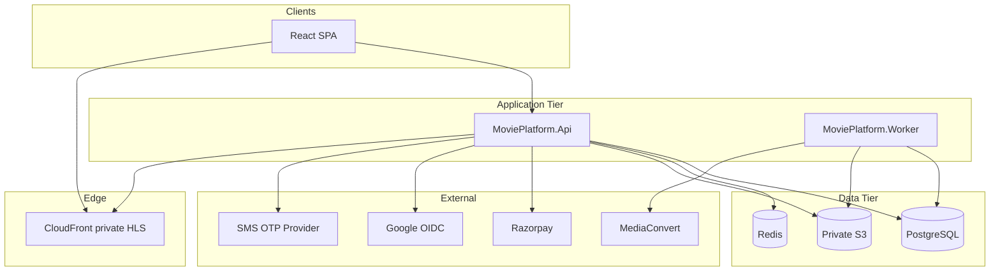

# Movie Streaming Platform — Architecture

## Overview

Licensed movie streaming platform delivered as a **modular monolith**: one deployable API and worker surface with clear module boundaries inside the solution. PostgreSQL is the system of record; Redis supports caching, rate limits, and session-adjacent data in later phases.

## Solution layers

| Layer | Project | Responsibility |
|-------|---------|----------------|
| Domain | `MoviePlatform.Domain` | Entities, enums, invariants — no infrastructure |
| Application | `MoviePlatform.Application` | Use cases, validators, authorization constants |
| Infrastructure | `MoviePlatform.Infrastructure` | EF Core, Identity, external adapters |
| API | `MoviePlatform.Api` | HTTP, OpenAPI, middleware, health |
| Worker | `MoviePlatform.Worker` | Encoding queue consumer (Phase 4+) |
| Tests | `MoviePlatform.Tests` | xUnit, integration, security tests |

## Modules (bounded contexts)

| Module | Primary aggregates | Notes |
|--------|-------------------|--------|
| Identity | User, Session, OTP challenge | ASP.NET Identity + external logins |
| Catalog | Movie, Genre, License | Publication workflow, territories |
| Media | UploadSession, EncodingJob, MediaAsset | S3 presign, HLS outputs |
| Orders | Order, OrderItem | Correlation with payments |
| Payments | Payment, PaymentEvent | Razorpay, webhooks, idempotency |
| Entitlements | Entitlement, Purchase | Server-side playback gate |
| Subscriptions | Plan, Subscription | Recurring billing, eligibility |
| Administration | Cross-cutting admin APIs | RBAC policies |
| Notifications | Notification | Email/SMS/in-app |
| Audit | AuditLog | Immutable operational trail |
| Reporting | Read models | Finance/support views |

## API versioning

All public REST routes are under `/api/v1/`. OpenAPI is exposed in Development at `/openapi/v1.json` (ASP.NET Core OpenAPI).

## Trust boundaries

See [security-trust-boundaries.md](./security-trust-boundaries.md) and [payment-trust-boundaries.md](./payment-trust-boundaries.md).

## Technology pins (Phase 1)

| Component | Version |
|-----------|---------|
| .NET | 10.0 LTS (`net10.0`) |
| EF Core + Npgsql | 10.0.0 |
| PostgreSQL | 16 (Docker) |
| Redis | 7 (Docker) |
| React | 19.x |
| Vite | 7.x |
| TanStack Query | 5.x |
| Zod | 4.x |
| Tailwind CSS | 4.x |
| shadcn/ui | latest (Phase 6 UI) |
