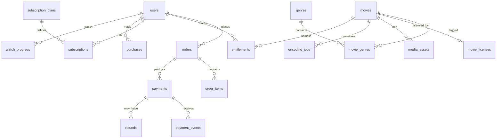

# Entity relationship overview

Core relationships (logical):

Physical schema is implemented in EF Core migration `InitialCreate` under `MoviePlatform.Infrastructure/Persistence/Migrations`.

Money fields use **minor units** (`bigint`) — e.g. ₹50 → `5000` paise.
